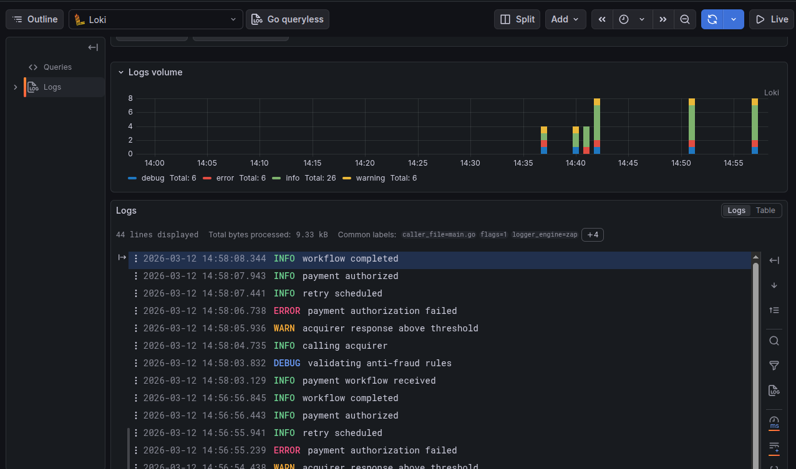
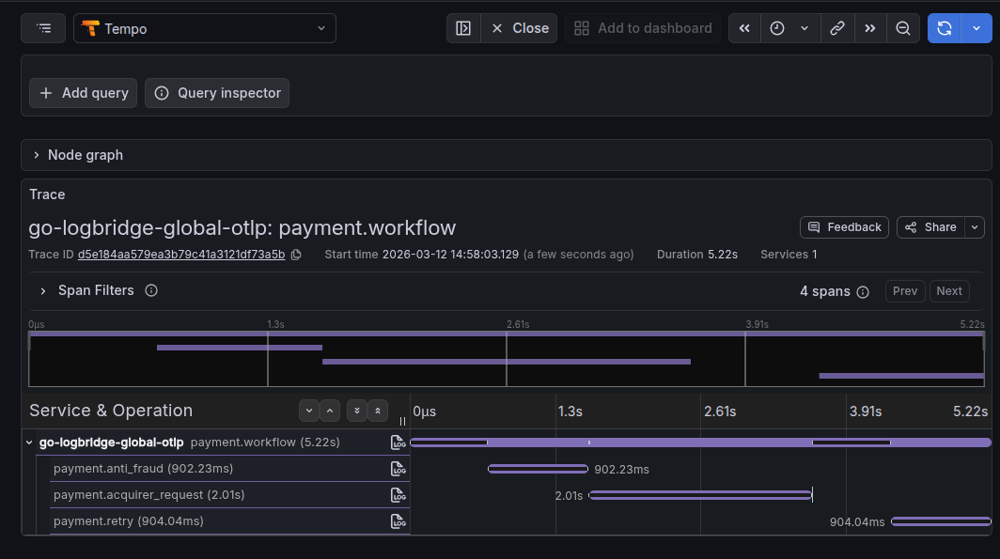
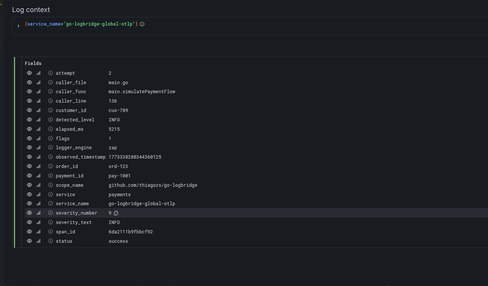

# go-logbridge

Wrapper de logging para Go com uma API única sobre `zap`, `slog`, `zerolog` e `logrus`, com suporte opcional a:

- campos estruturados
- caller (`arquivo`, `função`, `linha`)
- correlação com OpenTelemetry via `context.Context`
- export de logs OTLP







## Instalação

```bash
go get github.com/thiagozs/go-logbridge
```

## API

O logger expõe a mesma interface para todos os engines:

```go
type Logger interface {
    Debug(ctx context.Context, msg string, args ...any)
    Info(ctx context.Context, msg string, args ...any)
    Infof(ctx context.Context, format string, args ...any)
    Warn(ctx context.Context, msg string, args ...any)
    Warnf(ctx context.Context, format string, args ...any)
    Error(ctx context.Context, msg string, args ...any)
    Errorf(ctx context.Context, format string, args ...any)

    With(args ...any) Logger
}
```

Criação:

```go
log, err := logbridge.New(
    logbridge.WithEngine(logbridge.Zap),
    logbridge.WithLevel(logbridge.Debug),
    logbridge.WithJSON(),
)
if err != nil {
    panic(err)
}
```

## Engines suportados

```go
logbridge.Slog
logbridge.Zap
logbridge.Zerolog
logbridge.Logrus
```

## Exemplo básico

```go
package main

import (
    "context"

    "github.com/thiagozs/go-logbridge/logbridge"
)

func main() {
    log, err := logbridge.New(
        logbridge.WithEngine(logbridge.Zap), // motor utilizado
        logbridge.WithLevel(logbridge.Info), // define o nivel do log
        logbridge.WithJSON(), // formato json
        logbridge.WithCallerSkip(1), // ajusta o número de frames que serão ignorados
    )
    if err != nil {
        panic(err)
    }

    log.Info(context.Background(), "application started",
        "service", "payments",
        "version", "1.0.0",
    )
}
```

## Options disponíveis

### Engine e formato

```go
logbridge.WithEngine(logbridge.Zap)
logbridge.WithLevel(logbridge.Debug)
logbridge.WithJSON()
logbridge.WithCaller()
logbridge.WithServiceName("payments-api")
```

### OpenTelemetry no contexto

`WithOTEL()` não cria spans. Ela apenas instrui o logger a extrair `trace_id` e `span_id` do `context.Context`.

```go
log, err := logbridge.New(
    logbridge.WithEngine(logbridge.Zap),
    logbridge.WithOTEL(),
)
```

Se o `ctx` tiver um span válido, os logs serão enriquecidos com:

- `trace_id`
- `span_id`

### Export de logs OTLP

Você pode enviar logs diretamente para um collector OTLP:

```go
log, err := logbridge.New(
    logbridge.WithEngine(logbridge.Zap),
    logbridge.WithJSON(),
    logbridge.WithServiceName("payments-api"),
    logbridge.WithOTLPLogs("localhost:4317"),
)
```

Quando usar OTLP, finalize com `Shutdown` para forçar flush:

```go
shutdownCtx, cancel := context.WithTimeout(context.Background(), 5*time.Second)
defer cancel()

if err := logbridge.Shutdown(shutdownCtx, log); err != nil {
    panic(err)
}
```

### Uso com provider OTLP global

Se sua aplicação já inicializa OpenTelemetry Logs fora do wrapper, você pode reaproveitar o provider:

```go
log, err := logbridge.New(
    logbridge.WithEngine(logbridge.Zap),
    logbridge.WithGlobalOTLP(),
)
```

Ou passar explicitamente:

```go
log, err := logbridge.New(
    logbridge.WithEngine(logbridge.Zap),
    logbridge.WithOTLP(provider),
)
```

## Campos com `With(...)`

`With(...)` cria um logger filho com campos persistentes:

```go
base := log.With(
    "service", "payments",
    "env", "prod",
)

requestLog := base.With(
    "request_id", "req-123",
    "customer_id", "cus-789",
)

requestLog.Info(ctx, "payment received")
```

Se a mesma chave aparecer mais de uma vez, o valor mais recente sobrescreve o anterior.

## Padrão de erro

Quando um campo recebe um `error`, o wrapper normaliza a saída.

Exemplo:

```go
log.Error(ctx, "payment failed",
    "error", err,
)
```

Saída esperada:

- `error`: primeira linha da mensagem
- `error_type`: tipo concreto do erro
- `error_stack`: stack multiline normalizado em array
- `error_chain`: cadeia de unwrap, quando existir

Isso evita despejar blocos com `\n\t` dentro do payload.

## Caller

Com `WithCaller()`, o logger adiciona:

- `caller_file`
- `caller_func`
- `caller_line`

Exemplo:

```json
{
  "msg": "payment failed",
  "caller_file": "main.go",
  "caller_func": "main.main",
  "caller_line": "33"
}
```

## OpenTelemetry: o que o wrapper faz e o que ele não faz

O wrapper:

- extrai `trace_id` e `span_id` do `context.Context`
- envia logs OTLP quando configurado

O wrapper não:

- cria spans automaticamente
- substitui o bootstrap de tracing da sua aplicação

Se você quiser ver traces no Tempo, precisa criar spans reais com um `TracerProvider` e usar o `ctx` retornado por `tracer.Start(...)`.

## Exemplos

Exemplos disponíveis no repositório:

- `examples/zap`
- `examples/slog`
- `examples/zerolog`
- `examples/logrus`
- `examples/global_otlp`

`examples/global_otlp` mostra um fluxo real com:

- logs OTLP
- traces reais via OTLP
- correlação entre Loki e Tempo

## Testes

Rodar a suíte normal:

```bash
go test ./...
```

Rodar os testes de integração OTLP:

```bash
go test -tags=integration ./logbridge -v
```

## Resumo

Use `go-logbridge` quando você quiser:

- trocar de engine sem mudar a API do seu código
- manter logging estruturado consistente
- enriquecer logs com trace/span via `context`
- exportar logs para OTLP sem acoplar a aplicação a um engine específico

## License

Este projeto é distribuido sobre a licença MIT. Veja o arquivo [LICENSE](LICENSE) para mais detalhes.

## Autor

2026, Thiago Zilli Sarmento :heart:
